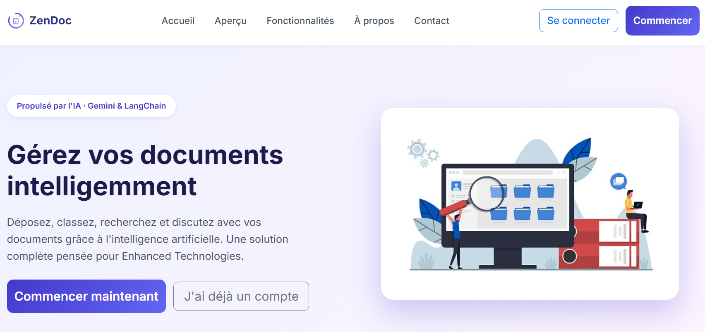
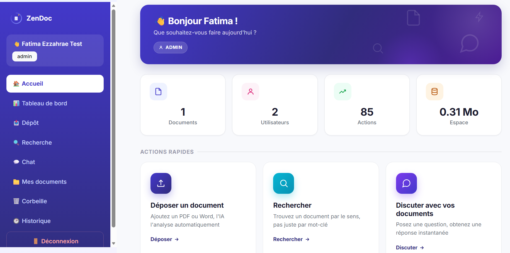
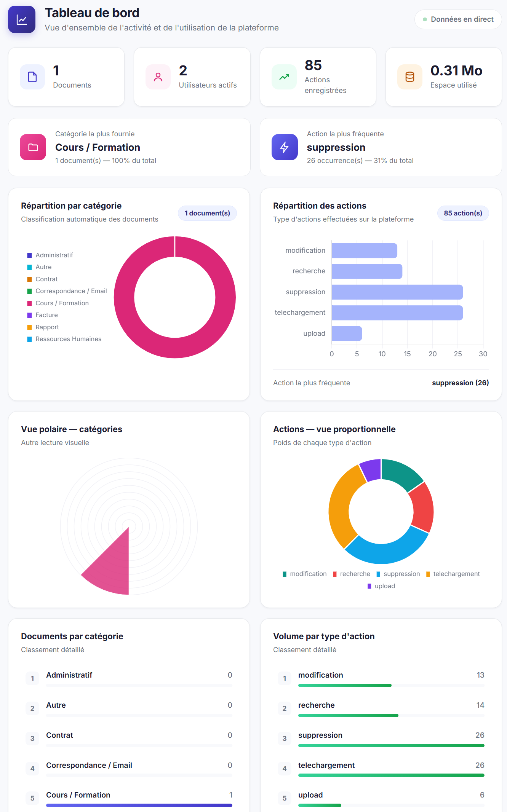
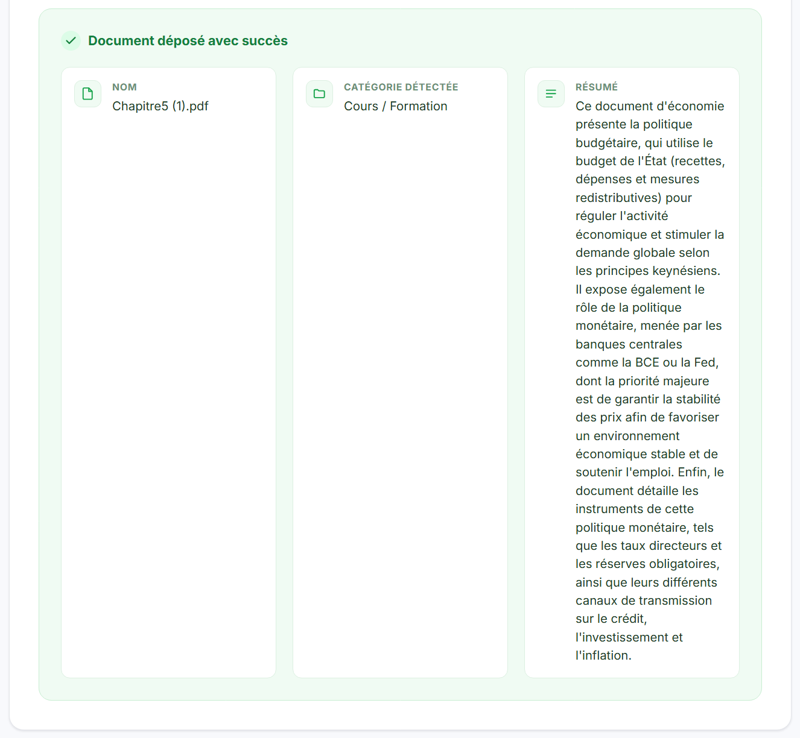
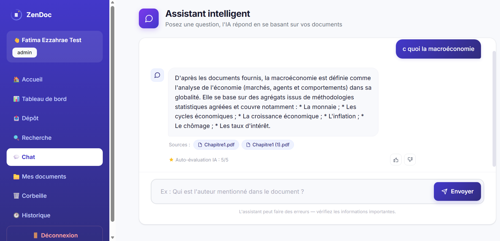
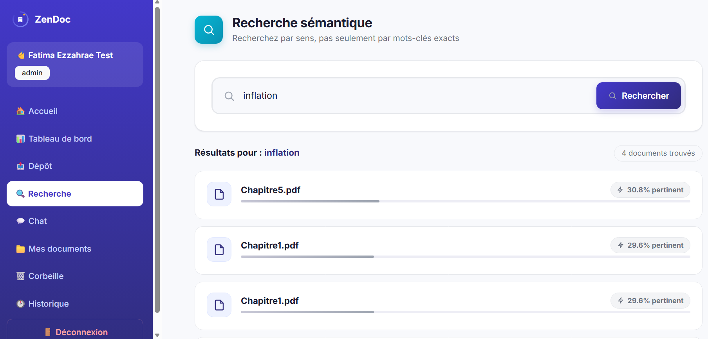
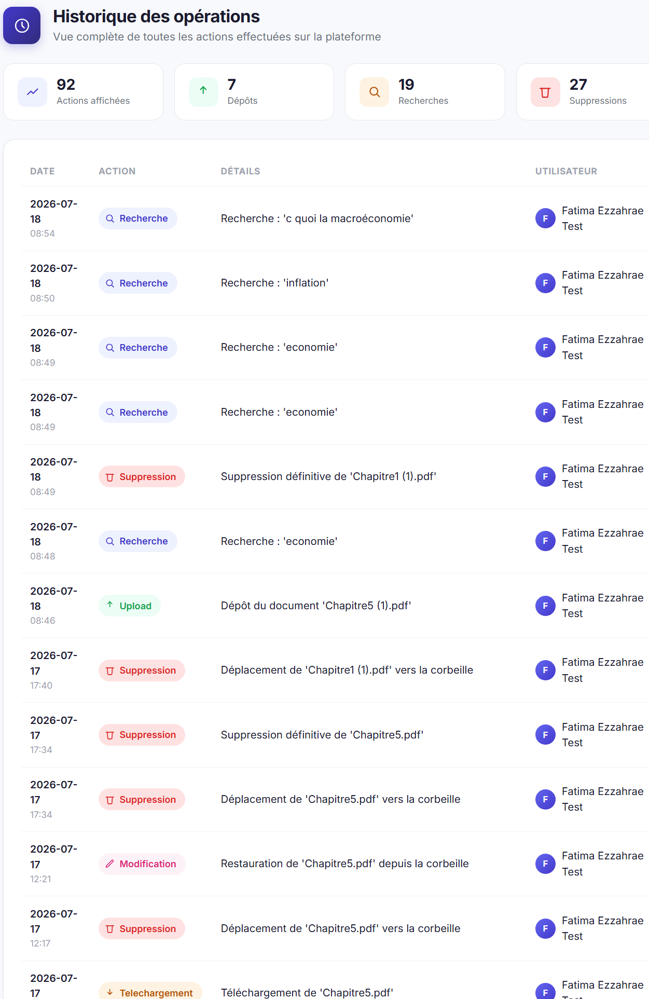
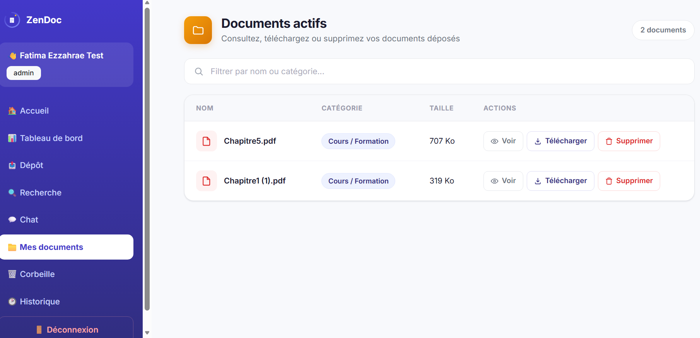
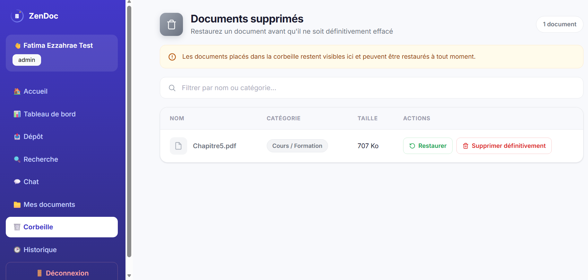
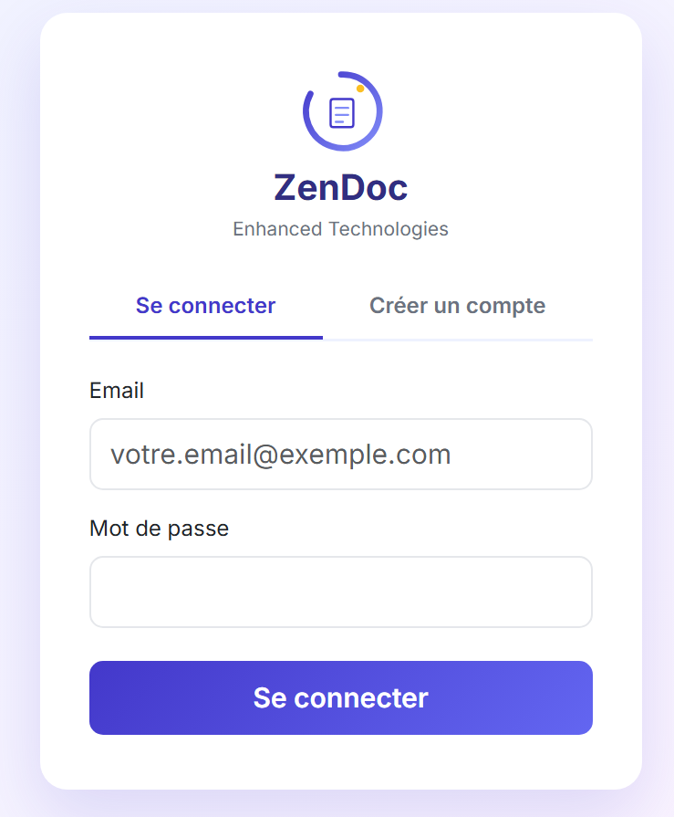

<div align="center">

#  ZenDoc

### AI-Powered Electronic Document Management System

**A full-stack application combining NLP, vector search, and LLM orchestration to automate document classification, semantic retrieval, and Retrieval-Augmented Generation (RAG).**



[](https://www.python.org/)
[](https://flask.palletsprojects.com/)
[](https://www.sqlalchemy.org/)
[](https://www.langchain.com/)
[](https://www.trychroma.com/)
[](https://ai.google.dev/)
[](LICENSE)

[Skills Demonstrated](#-skills-demonstrated) •
[Preview](#-preview) •
[Architecture](#-technical-architecture) •
[Installation](#-installation) •
[Data Model](#-data-model)

</div>

---

## 📌 Overview

**ZenDoc** is an end-to-end Electronic Document Management (EDM) platform built during a Data Science internship at **Enhanced Technologies** (Technopark Rabat). It goes beyond a simple CRUD file manager: every document uploaded is automatically **read, classified, summarized, and indexed** by an AI pipeline, and users can query their document base **conversationally**, in natural language, with cited sources.

The project was designed to demonstrate a complete, production-style AI application — not just a notebook — covering data modeling, backend engineering, NLP pipelines, and applied LLM evaluation.

---

## 🧠 Skills Demonstrated

This project was built to apply and showcase core Data Science / AI Engineering competencies in a real, deployable product:

| Domain | Applied in this project |
|---|---|
| **NLP & Text Processing** | Text extraction from PDF/DOCX, preprocessing pipelines for embedding generation |
| **Vector Embeddings & Semantic Search** | Document indexing and similarity search using **ChromaDB** vector store |
| **LLM Integration & Prompt Engineering** | Structured prompting for automatic classification, summarization, and RAG-based Q&A via the **Gemini API** |
| **Retrieval-Augmented Generation (RAG)** | Full RAG pipeline: retrieval → context injection → grounded generation → source citation |
| **LLM Evaluation** | **LLM-as-judge** pattern to auto-score response quality, combined with human feedback loops (👍/👎) |
| **Pipeline Orchestration** | **LangChain** used to chain retrieval, prompting, and generation steps |
| **Data Modeling** | Relational schema design (8 tables) with soft-delete, audit logging, and role-based access as first-class entities |
| **Backend Engineering** | RESTful routing, service-layer architecture (separation of concerns), server-side authorization |
| **Full-Stack Development** | Flask + Jinja2 + Bootstrap + Chart.js, from database to UI |
| **Security Engineering** | Password hashing (bcrypt), server-side ownership checks, secrets management via environment variables |

---

## 🖼 Preview

<table>
<tr>
<td width="50%"><p align="center"><em>Home dashboard</em></p></td>
<td width="50%"><p align="center"><em>Analytics dashboard (Chart.js)</em></p></td>
</tr>
<tr>
<td width="50%"><p align="center"><em>Automatic classification &amp; summarization (LLM)</em></p></td>
<td width="50%"><p align="center"><em>RAG-based conversational assistant with cited sources</em></p></td>
</tr>
<tr>
<td width="50%"><p align="center"><em>Semantic search (vector embeddings)</em></p></td>
<td width="50%"><p align="center"><em>Full audit trail / operations history</em></p></td>
</tr>
</table>

<details>
<summary>📷 More screenshots (My Documents, Trash, Login)</summary>
<br>
<table>
<tr>
<td width="33%"></td>
<td width="33%"></td>
<td width="33%"></td>
</tr>
</table>
</details>

---

## 🏗 Technical Architecture

```
┌───────────────┐     ┌────────────────┐     ┌──────────────────────┐
│   Frontend     │────▶│   Flask (API)   │────▶│    SQLAlchemy ORM     │
│ Bootstrap/JS/  │     │  routes.py /    │     │  (relational schema,  │
│  Chart.js      │     │  service layer  │     │   8 tables)            │
└───────────────┘     └────────┬────────┘     └──────────────────────┘
                                │
              ┌─────────────────┼─────────────────┐
              ▼                 ▼                 ▼
      ┌───────────────┐ ┌───────────────┐ ┌───────────────────┐
      │  Gemini API    │ │   ChromaDB     │ │    LangChain        │
      │ (classification,│ │ (vector store, │ │ (RAG orchestration:  │
      │  summarization, │ │  similarity    │ │  retrieval → prompt  │
      │  generation)    │ │  search)       │ │  → generation)       │
      └───────────────┘ └───────────────┘ └───────────────────┘
```

### Tech Stack

| Layer | Technologies |
|---|---|
| **Backend** | Python, Flask, SQLAlchemy (ORM) |
| **AI / NLP** | Google Gemini API, LangChain, ChromaDB (vector embeddings) |
| **Document parsing** | pypdf, python-docx |
| **Database** | SQLite (relational), ChromaDB (vector) |
| **Frontend** | Jinja2, Bootstrap, Chart.js, vanilla JS |
| **Security** | bcrypt (password hashing), server-side RBAC |

---

## ⚙️ Installation

### Prerequisites
- Python 3.10+
- A [Google Gemini](https://ai.google.dev/) API key

### Steps

```bash
# 1. Clone the repository
git clone https://github.com/<your-username>/zendoc-ged.git
cd zendoc-ged

# 2. Create a virtual environment
python -m venv venv
source venv/bin/activate      # On Windows: venv\Scripts\activate

# 3. Install dependencies
pip install -r requirements.txt

# 4. Configure environment variables
cp .env.example .env
# Then edit .env and add your Gemini API key

# 5. Initialize the database
python -m app.db.seed_data

# 6. Run the application
python main_web.py
```

The application is then available at `http://127.0.0.1:8000/`.

> ⚠️ **Never commit your `.env` file** — it contains your API key. This repository's `.gitignore` already excludes it by default.

---

## 🚀 Usage

1. Create an account from the home page
2. Upload a document (PDF or Word) from **Upload** — the AI pipeline extracts text, classifies it, and generates a summary automatically
3. Retrieve it by meaning via **Search** (semantic/vector search), or ask questions about it via **Chat** (RAG)
4. Monitor platform-wide activity from the **Dashboard**

📘 A **complete user guide** (screenshots + step-by-step instructions, French) is available at [`Guide_Utilisateur_ZenDoc.pdf`](Guide_Utilisateur_ZenDoc.pdf).

---

## 📁 Project Structure

```
zendoc-ged/
├── app/
│   ├── core/                  # Core configuration
│   ├── db/                    # SQLAlchemy models, DB connection, seed data
│   │   ├── database.py
│   │   ├── models.py
│   │   └── seed_data.py
│   ├── services/              # Business logic (service layer)
│   │   ├── document_service.py
│   │   ├── corbeille_service.py    # Trash / soft-delete logic
│   │   ├── historique_service.py   # Audit logging
│   │   ├── auth_service.py
│   │   ├── ai_service.py           # Classification & summarization (Gemini)
│   │   ├── search_service.py       # Semantic search (ChromaDB)
│   │   ├── rag_service.py          # RAG chat + LLM-as-judge evaluation
│   │   └── stats_service.py
│   ├── ui/                    # Desktop UI entry point
│   └── web/
│       ├── routes.py          # Flask routes
│       ├── static/            # CSS, JS, images
│       └── templates/         # Jinja2 templates
├── main_web.py                  # Entry point — run this to start the app
├── main.py                      # Alternate/desktop entry point
├── requirements.txt
├── .env.example
├── Guide_Utilisateur_ZenDoc.pdf  # User guide (French)
├── LICENSE
└── .gitignore
```

---

## 🗄 Data Model

8 relational tables: `users`, `documents`, `categories`, `tags`, `document_tags`, `historique`, `permissions`, `feedback`.

Key design points:
- **Soft-delete** on documents (`date_suppression`), enabling restore from trash without data loss
- **Full audit trail** via the `historique` table, linked to both user and document for complete traceability
- **Category-level permission model** already scaffolded (`peut_lire` / `peut_ajouter` / `peut_supprimer`), designed to support a future migration to fine-grained RBAC

---

## 🔒 Security

- Passwords hashed with **bcrypt** — never stored in plain text
- Authorization enforced **server-side** on every sensitive action (view, download, delete) — not merely hidden in the UI
- Strict per-user document isolation for non-admin accounts
- Secrets (API keys) managed via environment variables, excluded from version control

---

## 🔭 Possible Improvements

- Migrate from ownership-based access control to full category-level RBAC (schema already supports it)
- Add automated tests (unit tests for the service layer, integration tests for routes)
- Containerize with Docker for reproducible deployment
- Add pagination for large document/history lists

---

## 🎓 Project Context

Developed as part of a Data Science internship at **INSEA** (Institut National de Statistique et d'Économie Appliquée), hosted by **Enhanced Technologies**.

| | |
|---|---|
| **Author** | Fatima Ezzahrae |
| **Supervisor** | Mr. Chakiri |
| **Institution** | INSEA — Rabat |
| **Period** | 2026 |

---

## 📄 License

This project is licensed under the MIT License — see the [LICENSE](LICENSE) file for details.

<div align="center">

*Built with Flask, LangChain & the Gemini API*

</div>
